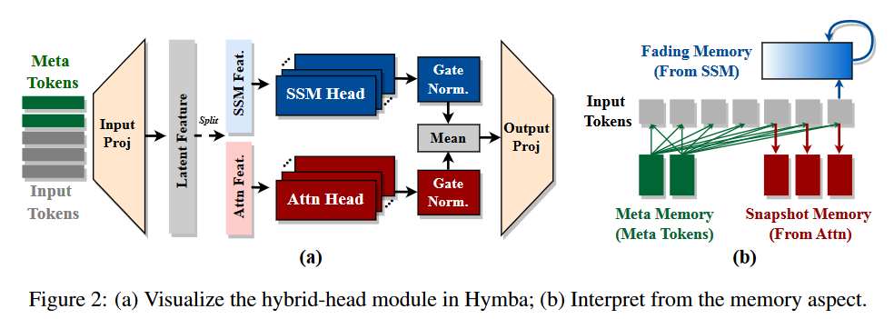

# 论文阅读

### Decoding-Time Language Model Alignment with Multiple Objectives

- motivation: 在基于人类反馈的学习中，不同的场景/用户有着不同的优化目标。为了提高系统的适应范围，有必要把不同的目标组合起来。

- novelty: 首次实现多目标解码，用特定的权重将各个单目标训练的模型的预测分布组合起来，同时通过正则化避免过度优化问题。

- reflection: 这个通过权重结合的思想感觉跟我们的方法差不多，最后的效果没有voting好。

### FedPFT: Federated Proxy Fine-Tuning of Foundation Models

- motivation: 现有的部分微调foundation models主要是通过压缩（layer drop）来实现的，这种方法面临两个问题，一是无法有效微调fm，二是缺乏sub-fm和fm的对齐。

- novelty: 在压缩的过程中只去除显著性较低的神经元（Q1）：采用固定的比例，系统地去除每层FFN中显著性较低的神经元，从而实现分层压缩。结合FL的思想，在微调的过程中进行communicate，边微调边对齐（Q2）。

